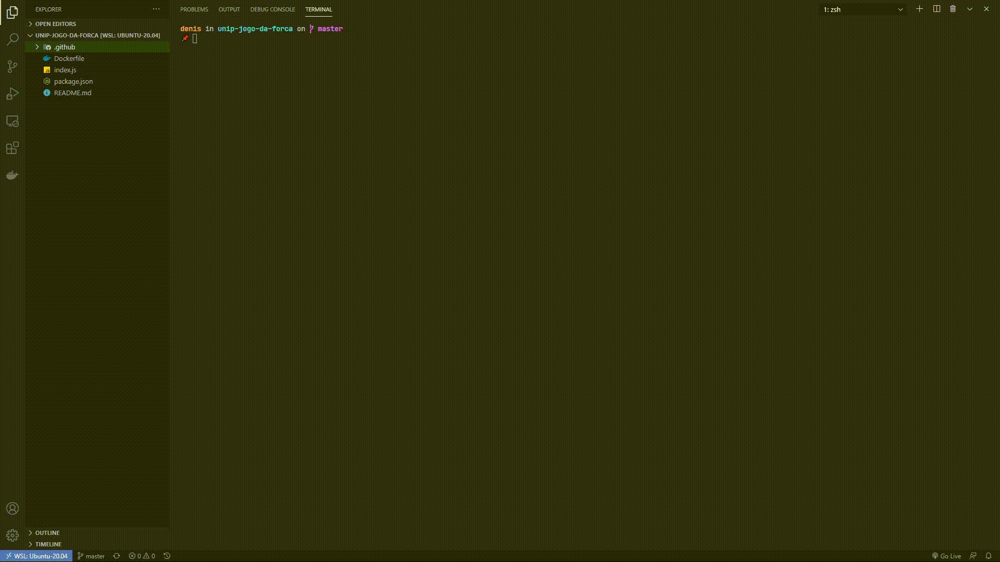

# UNIP - Jogo da forca

Unip - Ciência da computação - CC7P17

Denis Medeiros, RA: N2759E-1

Ana Clara Belissimo Martins, RA: N2728G-1

---


## Requisitos para executar

* NodeJs - versão v12.x
* NPM - versão v6.14.10

---
## Como executar 
```bash
git clone https://github.com/kollosso/unip-jogo-da-forca.git

cd unip-jogo-da-forca
```
---
### Maquina
```bash
npm install

npm run start

```

Acesse no navegador `http://localhost:8080`

---
### Docker 


```bash
// Dentro do terminal

docker build -t unipjogodaforca .

docker container run -it --name jogodaforca unipjogodaforca

docker exec -it jogodaforca bash

npm run start
```

Acesse no navegador `http://localhost:8080`